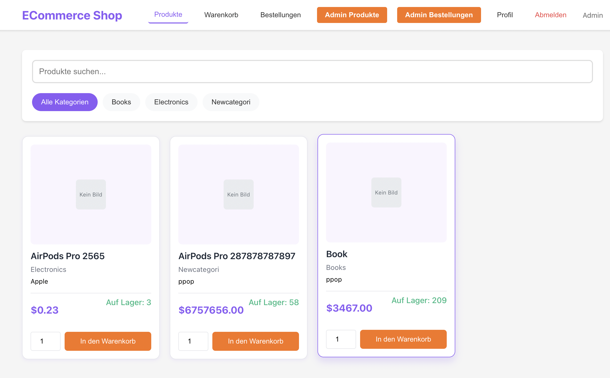
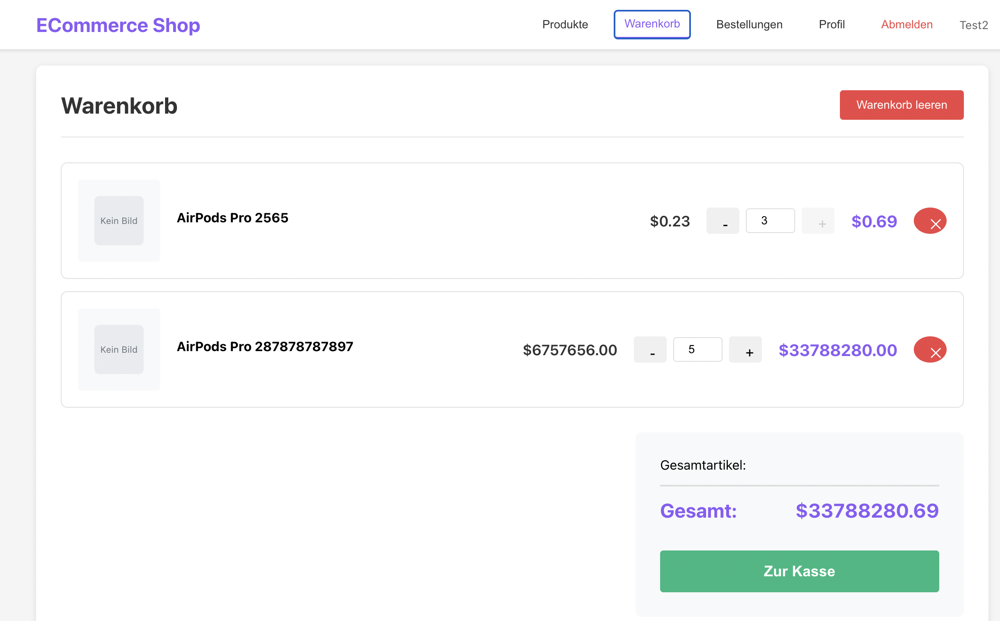
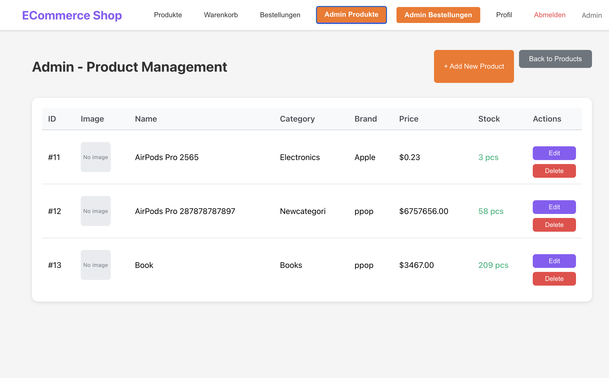

# E-Commerce Shop

A full-stack e-commerce application built with React and ASP.NET Core, featuring product management, shopping cart, order processing, and admin panel.

## Features

### User Features
- 🛍️ Browse products with detailed information
- 🛒 Shopping cart management
- 📦 Order placement and tracking
- 👤 User registration and authentication
- 📱 Responsive design
- 🔍 Product categories and filtering

### Admin Features
- 📊 Order management dashboard
- ✏️ Product CRUD operations
- 📈 Inventory management
- 👥 Order status updates

## Tech Stack

### Frontend
- **React** 19.2.0
- **Axios** for API calls
- **CSS3** for styling

### Backend
- **ASP.NET Core** 9.0
- **Entity Framework Core** 9.0
- **SQLite** database
- **RESTful API** architecture

### Testing
- **xUnit** for backend tests
- **React Testing Library** for frontend tests

## Project Structure

```
ECommShop/
├── backend/                    # ASP.NET Core API
│   ├── Controllers/           # API endpoints
│   ├── Models/               # Data models
│   ├── Data/                 # DbContext and seed data
│   ├── Migrations/           # EF Core migrations
│   └── Properties/           # Launch settings
├── frontend/                  # React application
│   ├── src/
│   │   ├── components/       # React components
│   │   ├── services/         # API service layer
│   │   └── App.js           # Main application component
│   └── public/              # Static files
└── ECommerceApi.Tests/       # Unit tests
```

## Prerequisites

- [.NET 9.0 SDK](https://dotnet.microsoft.com/download)
- [Node.js](https://nodejs.org/) (v14 or higher)
- [npm](https://www.npmjs.com/) or [yarn](https://yarnpkg.com/)

## Installation & Setup

### 1. Clone the repository

```bash
git clone <repository-url>
cd ECommShop
```

### 2. Backend Setup

```bash
cd backend

# Restore dependencies
dotnet restore

# Apply database migrations
dotnet ef database update

# Run the backend server
dotnet run
```

The API will be available at `https://localhost:5001` (or the port specified in `launchSettings.json`)

### 3. Frontend Setup

```bash
cd frontend

# Install dependencies
npm install

# Start the development server
npm start
```

The React app will open at `http://localhost:3000`

## Database

The application uses SQLite for data storage. The database file will be created automatically when you run migrations. Sample data is seeded on first run.

### Run Migrations

```bash
cd backend
dotnet ef migrations add <MigrationName>
dotnet ef database update
```

## API Endpoints

### Products
- `GET /api/products` - Get all products
- `GET /api/products/{id}` - Get product by ID
- `POST /api/products` - Create new product (Admin)
- `PUT /api/products/{id}` - Update product (Admin)
- `DELETE /api/products/{id}` - Delete product (Admin)

### Users
- `POST /api/users/register` - Register new user
- `POST /api/users/login` - User login
- `GET /api/users/{id}` - Get user profile
- `PUT /api/users/{id}` - Update user profile

### Cart
- `GET /api/cart/{userId}` - Get user's cart
- `POST /api/cart` - Add item to cart
- `PUT /api/cart/{id}` - Update cart item quantity
- `DELETE /api/cart/{id}` - Remove item from cart
- `DELETE /api/cart/user/{userId}` - Clear cart

### Orders
- `GET /api/orders` - Get all orders (Admin)
- `GET /api/orders/user/{userId}` - Get user's orders
- `GET /api/orders/{id}` - Get order details
- `POST /api/orders` - Create new order
- `PUT /api/orders/{id}/status` - Update order status (Admin)

## Testing

### Backend Tests

```bash
cd ECommerceApi.Tests
dotnet test
```

### Frontend Tests

```bash
cd frontend
npm test
```

## Screenshots

### Product Catalog


### Shopping Cart


### Admin Dashboard



## Configuration

### Backend Configuration

Edit `appsettings.json` or `appsettings.Development.json`:

```json
{
  "ConnectionStrings": {
    "DefaultConnection": "Data Source=ecommerce.db"
  }
}
```

### Frontend Configuration

Update API base URL in `src/services/api.js` if needed:

```javascript
const API_BASE_URL = 'https://localhost:5001/api';
```

## Default Users

After seeding, you can use these credentials:

- **Admin User:**
  - Email: admin@ecommerce.com
  - Password: Admin123!

- **Regular User:**
  - Email: user@ecommerce.com
  - Password: User123!

## Features in Detail

### User Authentication
- Secure login and registration
- Password hashing
- Session management via localStorage

### Shopping Cart
- Add/remove products
- Update quantities
- Real-time price calculations
- Persistent cart data

### Order Management
- Order placement
- Order history
- Status tracking (Pending, Processing, Shipped, Delivered, Cancelled)

### Admin Panel
- Product management (Create, Read, Update, Delete)
- Order management
- Inventory tracking
- Status updates

## Contributing

1. Fork the repository
2. Create your feature branch (`git checkout -b feature/AmazingFeature`)
3. Commit your changes (`git commit -m 'Add some AmazingFeature'`)
4. Push to the branch (`git push origin feature/AmazingFeature`)
5. Open a Pull Request

## License

This project is licensed under the MIT License.


Built with ❤️ using React and ASP.NET Core
